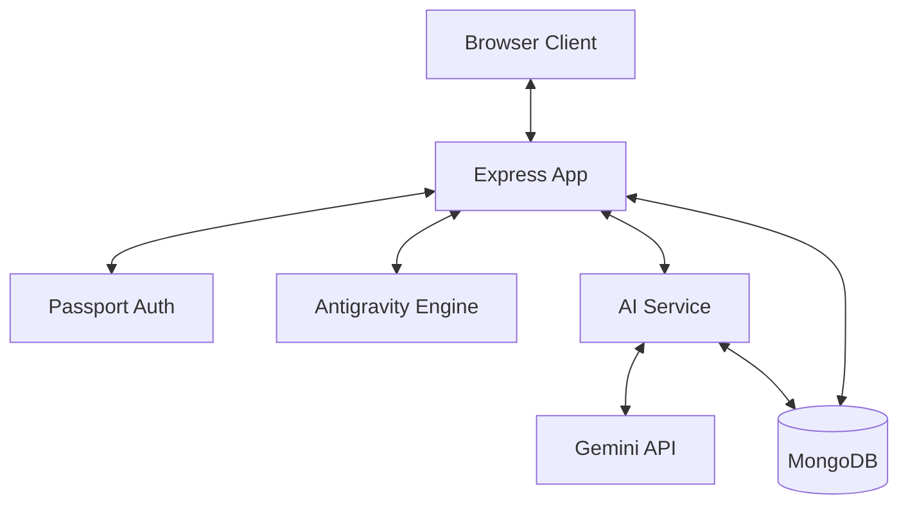

# Architecture

> Auto-generated by /map on 2026-02-15

## Overview

Zoho Note Compailor is a feature-rich notebook and competitive coding platform. it allows users to create, manage, and share multi-cell notebooks with polyglot code execution capabilities. It also features a "Game" component where users can complete AI-generated coding quests to earn points.

## Layers

┌─────────────────────────────────────────┐
│              [Browser Client]           │
│        Handlebars Views + Vanilla JS    │
├─────────────────────────────────────────┤
│         [Express Server Layer]          │
│        Auth, CSRF, Session, Routes      │
├─────────────────────────────────────────┤
│         [Business Logic Layer]          │
│     Controllers, AI Service, Engine     │
├─────────────────────────────────────────┤
│            [Data Layer]                 │
│         Mongoose Models, MongoDB        │
└─────────────────────────────────────────┘

## Components

### Antigravity Engine
- **Purpose:** Executes code in various languages (JS, Python, C, C++, Java) safely.
- **Location:** `engine/AntigravityEngine.js`
- **Dependencies:** `node:vm`, `child_process`, `fs`, `os`

### AI Service
- **Purpose:** Generates coding quests and provides pedagogical assistance ("The Master").
- **Location:** `services/aiService.js`
- **Dependencies:** `@google/generative-ai`, `fs`, `path`

### Admin Controller
- **Purpose:** Manages users, system logs, and feedback.
- **Location:** `controllers/adminController.js`
- **Dependencies:** `User`, `SystemLog`, `Feedback` models

### Game Controller
- **Purpose:** Handles quest progression, verification, and scoring.
- **Location:** `controllers/gameController.js`
- **Dependencies:** `Quest`, `User` models, `aiService`

## Data Flow

1. **Auth Flow:** User logs in via Local or Google OAuth -> Session established -> Passport attaches user to `req.user`.
2. **Notebook Flow:** User creates/edits note -> Frontend sends JSON content -> Express saves to `Note` model in MongoDB.
3. **Execution Flow:** User clicks "Run" -> Frontend sends code/lang -> `AntigravityEngine` executes -> Result returned to UI.
4. **Game Flow:** `aiService` seeds quests in background -> User picks a quest -> Submits solution -> `gameController` verifies using `AntigravityEngine` -> Points awarded.

## Integration Points

| Service | Type | Purpose |
|---------|------|---------|
| Google OAuth | OAuth2.0 | Authentication |
| Google Gemini | LLM API | AI-powered quest generation and logic coaching |
| MongoDB Atlas | Database | Persistent storage for notes, users, and quests |

## Technical Debt

- [ ] **app.js Bloat:** `app.js` contains a lot of route logic that should be moved to separate route/controller files.
- [ ] **CSRF Management:** CSP is disabled in Helmet for simplicity; could be hardened.
- [ ] **Temporary Files:** `AntigravityEngine` writes to temp files for non-JS execution; could use a more robust containerized approach for better isolation.
- [ ] **Error Handling:** Some API routes have basic try-catch; could benefit from a centralized error handler.

## Conventions

**Naming:** CamelCase for classes/files, camelCase for methods/variables. Models are Singular PascalCase.
**Structure:** Traditional MVC with a separate `services/` and `engine/` layer for core logic.
**Testing:** No automated tests found (only manual seeder and diagnostic scripts).
